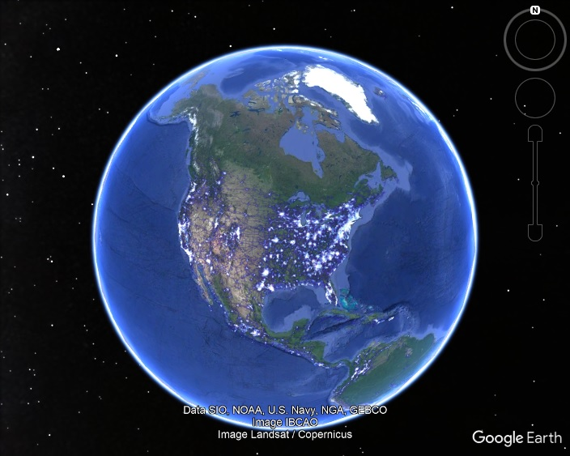
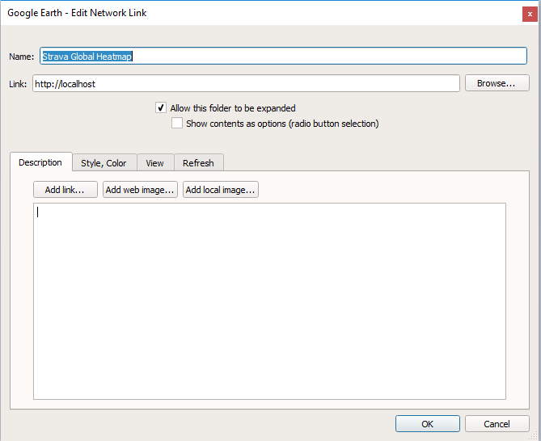

# heatmap2kml

### Make [Strava Global Heatmap](https://www.strava.com/heatmap) available as a KML Network Source in Google Earth.

Build
--------
`docker build . -t heatmap`

Run
--------
`docker run -it --rm -p 80:80 heatmap`

Add to Google Earth
--------
Add a new Network Link pointing to the Docker container.

Known Issues
--------
Currently you must manually edit osmtiles2kml.pl to include the hostname of the Docker container, if it's not being accessed at localhost.
